# Capstone Project: Serverless API & Containerized Web App
## Create new repository
Created a new repository in GitHub called AWS-PROJECTCAPSTONE-1

## Clone the repository 
`https://github.com/vokemwa/AWS-ProjectCapstone-1.git`

## Create the files
Create the files and folders in VS code i.e. lambda-api/index.js, webapp/Dockerfile, infrastructure.yaml anf README.md files

## Save the files and push to repository
`git add .`
`git commit -m`
`git push`

## Create Lambda
* Search for Lambda in AWS console
* Create lambda function
* Keep author from scratch seleted
* Give a function name 'CapstoneProject1-backend'
* select runtime 'Node.JS 24.x'
* Architecture use the default 'x86_64'
* click Create Function Button
* Edit the source code and paste the sample we were given
* Click deploy

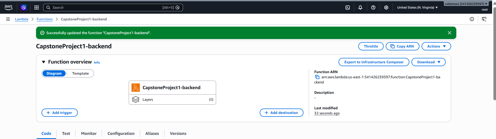

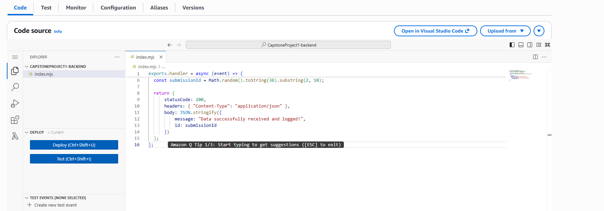

## Create REST API
* search for REST API
* Select New API
* Give it a name 'ProjectCapstone1-API'
* End point Type 'Regional'
* IP Address Type 'IPv4'
* Click Create API button

### Create Resources
* Create Resources
* Maintain Resource Path `/`
* Resource Name `submit`
* Click Create resource

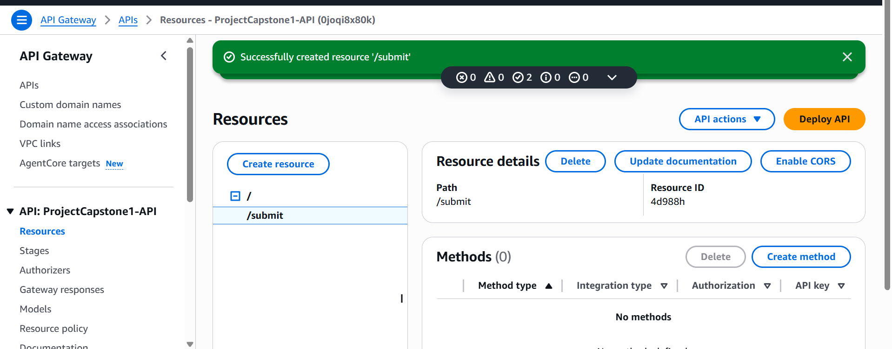

### Create Method
* Select /submit resource and click Create method
* Select Method type `POST`
* Integration Type `Lambda function`
* Select the region and the Lambda function
* Click Create method

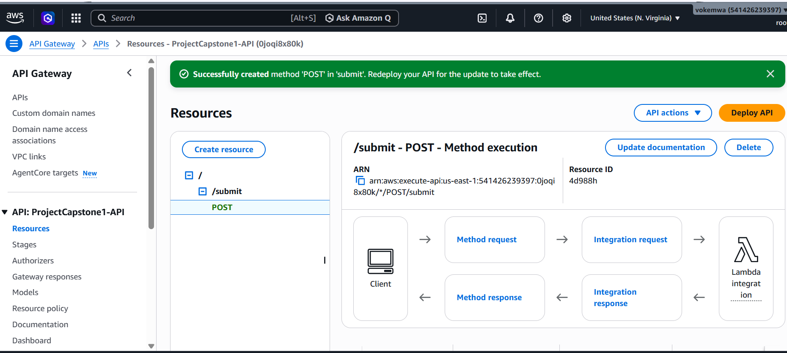

### Deploy The API
* Click Deploy
* Select *New stage*
* Stage name `Production`
* Click Deploy

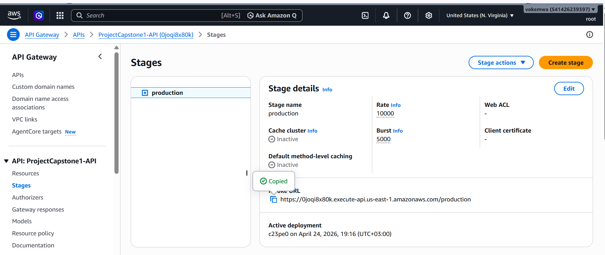

### Success REST API

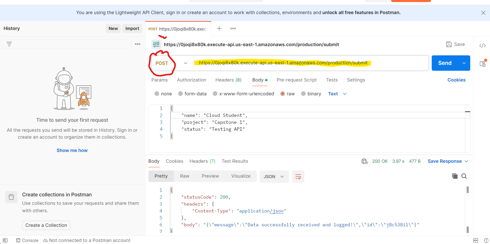

## Infrastructure as Code & Containerized Web App
* Created index.html file inside webapp folder. This is the same folder having the Dockerfile

## Create repository in ECR
* search ECR in the console and open in new tab
* Click create repository
* Give it a name `CapstoneProject1-Repo`

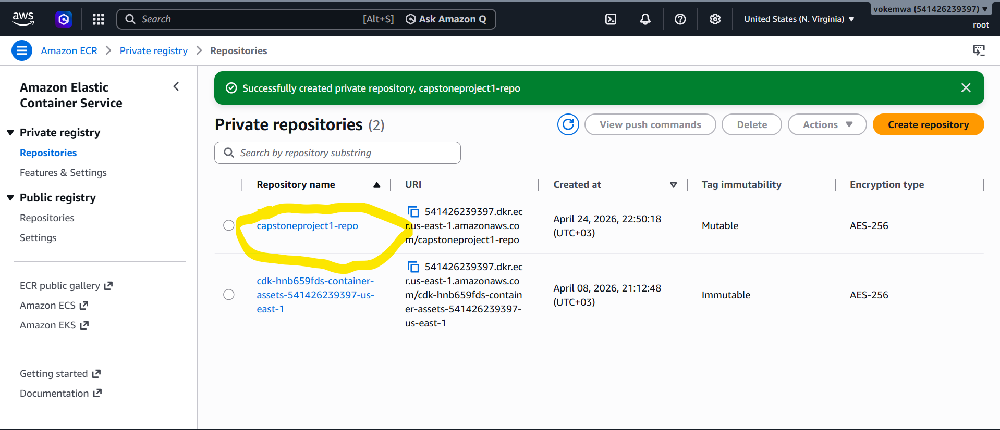

* Create the repository by keeping everything default

### Push commands
* Click the repository created
* Click view push commands button
* The first push command screenshot

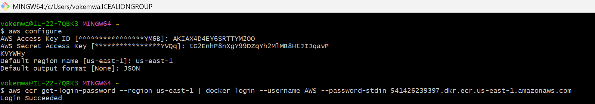

* The second push command screenshot

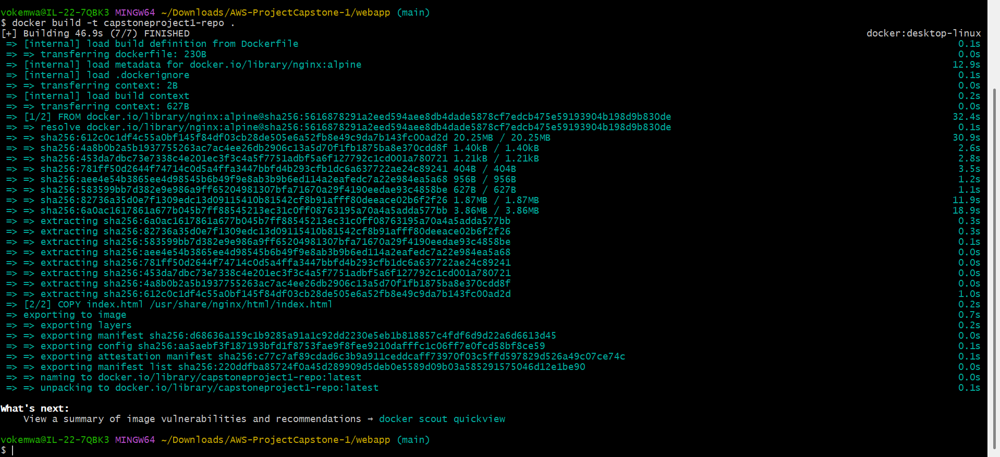

* The fourth push command screenshot with errors

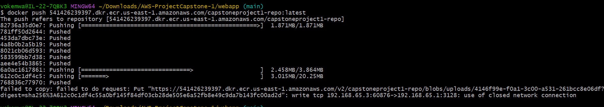

* After troubleshooting, here is the screenshot for the fourth push command

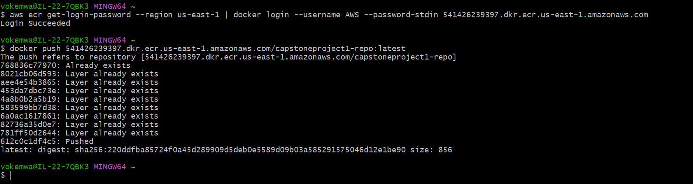

* The image is in the repository

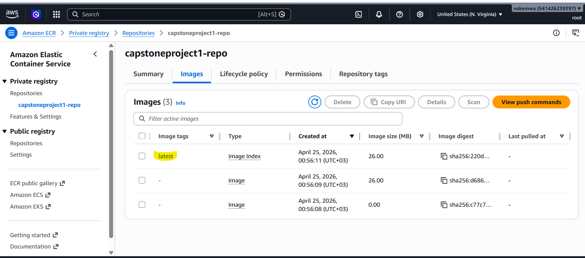

## CloudFormation Template and Fargate
* Edit the yaml template and deploy the template

* search for cloudformation in the console
* Create stack
* select upload template option
* give it a name `capstoneproject1-deployment`

* The stack has completed

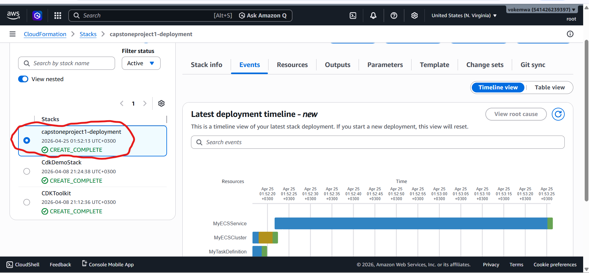

* This is my cluster

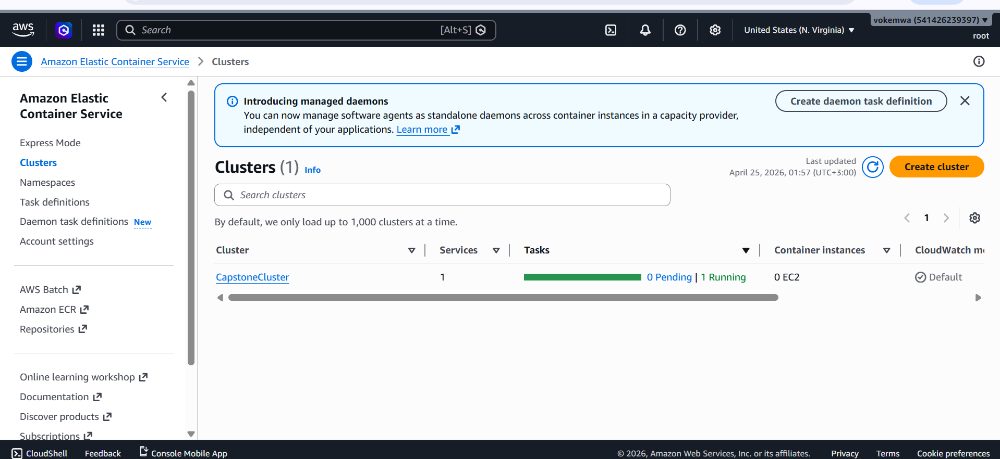

# My final index web page

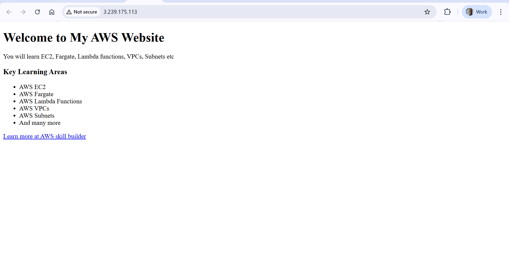

